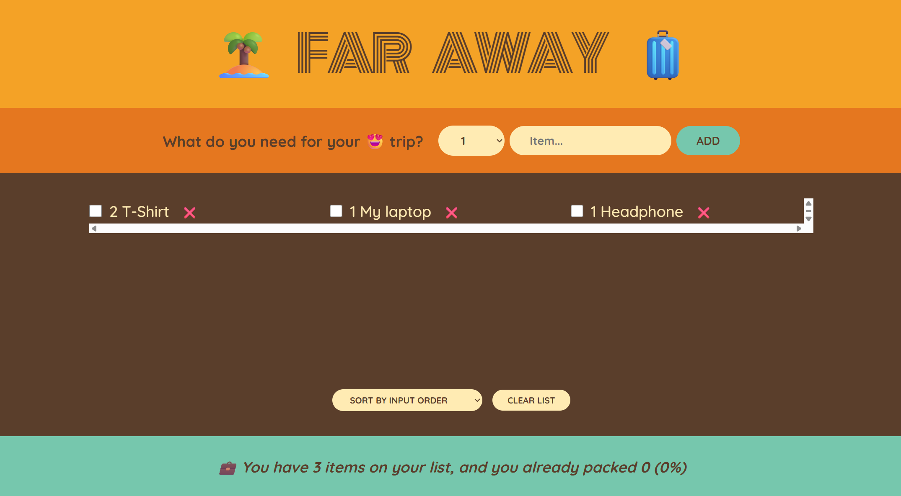

# Travel List App ✈️

A simple React application to help users organize their travel packing list.  
You can add, remove, and mark items as packed to keep track of everything you need for your trip.

---

## Features
- ➕ Add new items to the packing list  
- ✅ Mark items as packed or unpacked  
- 🗑️ Remove items from the list  
- 📊 See summary of packed vs. unpacked items  

---

## Screenshots
### Main Interface

---

## Tech Stack
- React  
- JavaScript (ES6+)  
- CSS (basic styling)  

---

### 📝 Note  
This project is part of the **React Course by Jonas Schmedtmann**.

## Purpose
This project was built to practice **React fundamentals**, including:
- Component structure  
- State management with `useState`  
- Handling user input  
- Conditional rendering  

---

## Author
Developed by **Sherif Ali** 🚀
